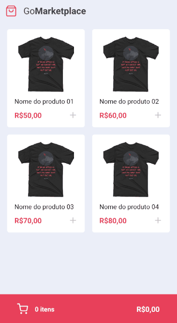

<h1 align="center" >
  GoMarketPlace
</h1>
<h1 align="center">
  
</h1>
<h3 align="center" >
  A simple cart system to add and remove products, using ContextAPI and AsyncStorage
</h3>

<p align="center">

  <a href="https://github.com/fernandonati" target="_blank">
    
  </a>
  <a href="https://github.com/fernandonati" target="_blank" >
    
  </a>
  <a href="https://www.linkedin.com/in/fernando-nati/" target="_blank" >
    
  </a>
  <a href="mailto:fernandonati@gmail.com" target="_blank" >
    
  </a>

</p>

<p align="center">
  <a href="#Description">Description</a>&nbsp;&nbsp;&nbsp;|&nbsp;&nbsp;&nbsp;
  <a href="#computer-languages">Languages</a>&nbsp;&nbsp;&nbsp;|&nbsp;&nbsp;&nbsp;
  <a href="#books-technologies">Technologies</a>&nbsp;&nbsp;&nbsp;|&nbsp;&nbsp;&nbsp;
  <a href="#install">Install</a>&nbsp;&nbsp;&nbsp;|&nbsp;&nbsp;&nbsp;
  <a href="#books-usage">Usage</a>&nbsp;&nbsp;&nbsp;|&nbsp;&nbsp;&nbsp;
  <a href="#memo-license">License</a>
</p>

## Description

On this project we created a cart context to encompass all the application, with this context, we created some hooks to manage the state of the products over the application. Basically, we create an effect to listen to all the changes and save that changes at asyncstorage, to don't lose the cart when you leave the application, and created the hooks(increment and decrement), to manage the products state.

## :computer: Languages

- **#TypeScript**

## :books: Technologies

- **#React**
- **#ReactNative**
- **#ESLint**
- **#Prettier**
- **#Styled-Components**
- **#Axios**
- **#ContextAPI**
- **#AsyncStorage**

## Install

```sh
yarn android
or
yarn ios
```

## Usage

```sh
yarn start
```

## Author

👤 **Fernando Nati**

* Github: [@fernandonati](https://github.com/fernandonati)
* Linkedin: [@fernandonati](https://www.linkedin.com/in/fernando-nati/)

## 🤝 Contributing

Contributions, issues and feature requests are welcome!<br />Feel free to check [issues page](https://github.com/fernandonati/GoMarketPlace/issues).

## Show your support

Give a ⭐️ if this project helped you!

## 📝 License

Copyright © 2020 [Fernando Nati](https://github.com/fernandonati).<br />
This project is [MIT](https://github.com/fernandonati/GoMarketplace/blob/master/LICENSE) licensed.

---

Made by :blue_heart: by [Fernando Nati](https://github.com/fernandonati)
